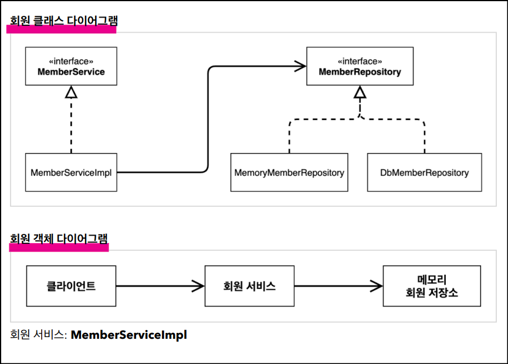
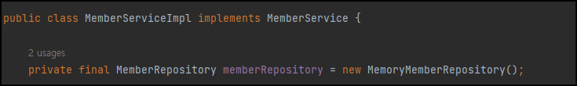
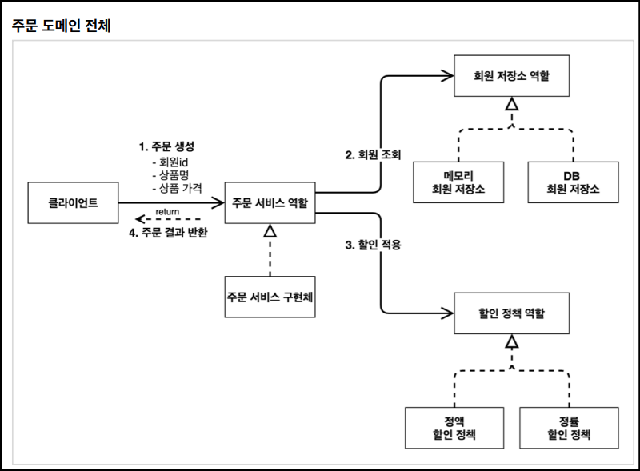
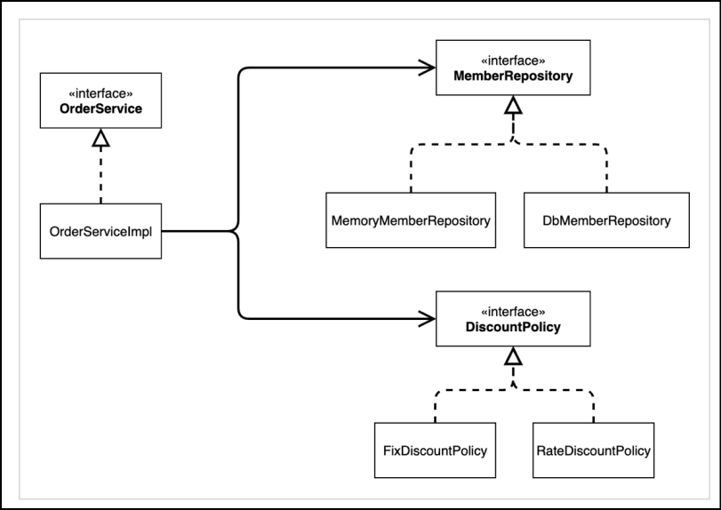
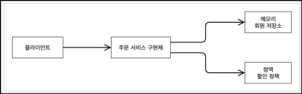
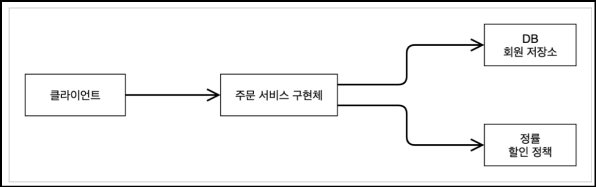

# 🟢 스프링 핵심 원리 - 기본편

## 📄 Section01 - 객체 지향 설계와 스프링
### ✅ Build and run 설정
- File - Settings - gradle 
  - Build and run using - Intellij IDEA
  - Run tests using - Intellij IDEA

 

### ✅ 비즈니스 요구사항과 설계
- 회원
  - 회원을 가입하고 조회할 수 있다.
  - 회원은 일반과 VIP 두 가지 등급이 있다.
  - 회원 데이터는 자체 DB를 구축할 수 있고, 외부 시스템과 연동할 수 있다. (미확정)  

- 주문과 할인 정책
  - 회원은 상품을 주문할 수 있다.
  - 회원 등급에 따라 할인 정책을 적용할 수 있다.
    - 할인 정책은 모든 VIP는 1000원을 할인해주는 고정 금액 할인을 적용해달라. (나중에 변경 될 수
    있다.)
    - 할인 정책은 변경 가능성이 높다. 회사의 기본 할인 정책을 아직 정하지 못했고, 오픈 직전까지 고민을
    미루고 싶다. 최악의 경우 할인을 적용하지 않을 수 도 있다. (미확정)

 

### ✅ 회원 도메인 설계, 개발 및 실행, 테스트
- 도메인 설계: 클래스 다이어그램 VS 객체 다이어그램
  - 클래스 다이어그램: 실제 서버를 실행X, 클래스만 분석하는 과정
  - 객체 다이어그램: 실제 서버를 실행O, 동적으로 사용하는 과정 
  - 

- 도메인 개발 및 실행: 
  - Grade(Enum), Member(Class)
  - MemberRepository -> MemoryMemberRepository
  - MemberService -> MemberServiceImpl
  - MemberApp

- 도메인 테스트
  - junit을 통해 assertj로 판별

- 도메인 설계의 문제점
  - OCP 원칙(다른 저장소로 변경), DIP 원칙
  -> 위배: _**인터페이스**_ 뿐만 아니라 _**구현**_ 까지 모두 의존
  - 

 

### ✅ 주문 도메인 설계, 개발 및 실행, 테스트
- 도메인 설계: 
  - 
  - 
  - 
  - 

- 도메인 개발 및 실행:
  - OrderSerivce -> OrderServiceImpl
  - DiscountPolicy -> FixDiscountPolicy, RateDiscountPolicy