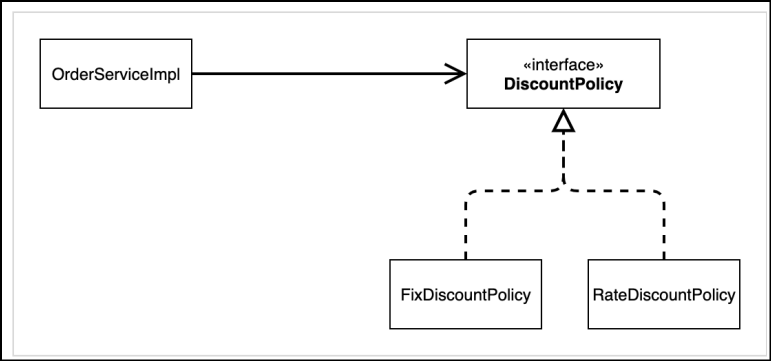

# 🟢 스프링 핵심 원리 - 기본편

## 📄 Section03 - 스프링 핵심 원리 이해2 - 객체 지향 원리 적용
### ✅ 새로운 할인 정책 설계, 개발 및 실행, 테스트
- 도메인 설계
  - 

- 도메인 설계의 문제점
  - 역할과 구현 분리 -> O
  - 다형성 활용, 인터페이스 및 구현 분리 -> O
  - OCP 원칙(다른 할인정책으로 변경) -> X
    - 기능을 확장해서 변경하면, 클라이언트 코드에 영향을 줌
  - DIP 원칙 -> X
    - OrderServiceImpl이 DiscountPolicy(추상)뿐만 아니라 FixDiscountPolicy, RateDiscountPolicy(구현)에 의존
    - _**추상**_ 뿐만 아니라 _**구현**_ 까지 모두 의존
  - 
  - 

### ✅ 관심사의 분리
- AppConfig
  - 애플리케이션의 전체 작동 방식을 구성(config)하기 위해 ***구현 객체***를 ***생성하고 연결***하는 책임을 가지는 클래스
  - 구현 객체 생성, 생성자를 통해 주입(의존관계 주입, 의존성 주입, DI=Dependency Injection)
    - MemberServiceImpl -> MemoryMemberRepository
    - OrderServiceImpl -> MemoryMemberRepository, RateDiscountPolicy
  - OCP 원칙 -> O
    - 할인 정책을 변경하면, 클라이언트 코드(OrderServiceImpl)영향X
    - 할인 정책을 변경하면, AppConfig 영향O
  - DIP 원칙 -> O
    - MemberServiceImpl은 MemberRepository(추상)에 의존
    - OrderServiceImpl은 MemberRepository, DiscountPolicy(추상)에 의존
  - 관심사의 분리 -> O
    - 구현 객체를 ***생성하고 연결하는 역할***과 ***실행하는 역할*** 분리

- AppConfig 개선
  - MemberService, OrderService의 MemoryRepository 중복 제거
  - MemberService, OrderService의 생성자(new)가 아닌 메소드를 통해 역할과 구현 구분

### ✅ SOLID 3가지 원칙 정리
- SRP 단일 책임 원칙
  - 한 클래스는 하나의 책임
  - AppConfig: 구현 객체를 생성하고 연결 책임
  - 클라이언트: 실행하는 책임

- DIP 의존관계 역전 원칙
  - 추상화 의존O, 구체화 의존X
  - OrderServiceImpl이 DiscountPolicy(추상)뿐만 아니라 FixDiscountPolicy, RateDiscountPolicy(구현)에 의존
    - AppConfig로 해결

- OCP 개방 폐쇄 원칙
  - 확장에는 열려있지만, 변경에는 닫힘
  - 할인 정책을 변경하면, 클라이언트 코드(OrderServiceImpl)영향X
  - 할인 정책을 변경하면, AppConfig 영향O

### ✅ IOC, DI, 컨테이너
- IOC(제어의 역전)
  - 프로그램의 제어 흐름을 직접 제어하는 것이 아니라 외부에서 관리 
  - 변경 전) 구현 객체 -> 프로그램의 제어 흐름 조종
  - 변경 후) AppConfig -> 프로그램의 제어 흐름 조종 / 구현 객체 -> 로직 실행
    - 프레임워크 vs 라이브러리
      - 프레임워크: 프레임워크가 코드를 제어, 실행 ex)JUnit
      - 라이브러리: 작성코드가 제어의 흐름 담당

- DI(의존관계 주입)
  - DI(의존관계 주입)을 사용하면 클라이언트 코드를 변경X, 클라이언트가 호출하는 대상의 인스턴스 변경O
  - DI(의존관계 주입)을 사용하면 정적인 클래스 의존관계 변경x, 동적인 객체 인스턴스 의존관계 변경O
    - **_정적인 클래스 의존관계(클래스 다이어그램)_**
      - 클래스가 사용하는 import 코드만 보고 의존관계 판단
      - 애플리케이션 실행X
      - 어떤 객체가 주입되는지 알 수 X
    - **_동적인 객체 인스턴스 의존관계(객체 다이어그램)_**
      - 애플리케이션 실행 시점에 실제 생성된 객체 인스턴스의 참조가 연결된 의존관계 판단
      - 객체 인스턴스 생성, 참조값 전달하여 연결
  

- IOC 컨테이너, DI 컨테이너
  - AppConfig 처럼 객체를 생성하고 관리하는 컨테이너
  - DI(의존관계 주입) 초점을 맞추어 **_DI 컨테이너_** 로 부름
  - **_어셈블러, 오브젝트 팩토리_** 부름

### ✅ 스프링 적용
- 스프링 컨테이너(ApplicationContext)
  - 변경 전) AppConfig -> 객체 생성과 연결을 위한 주입
  - 변경 후) 스프링 컨테이너 -> 객체 생성과 연결을 위한 주입
  
  - 스프링 컨테이너는 **_@Configuration이 붙은 AppConfig_** 를 **_설정 정보로 사용_**
  - 스프링 컨테이너는 **_@Bean이 붙은 메소드_** 를 모두 **_호출해서 반환 객체를 등록_**