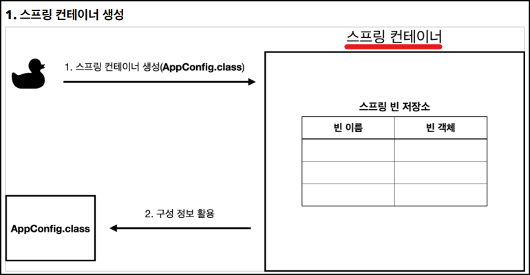
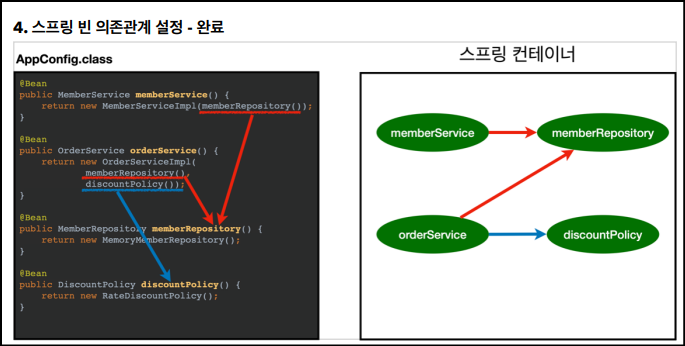
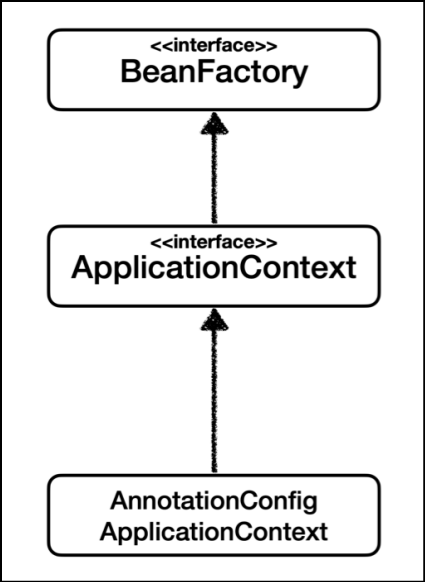
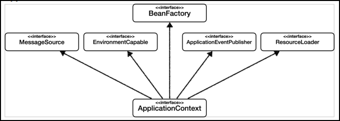
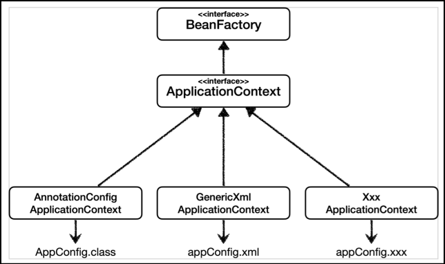

# 🟢 스프링 핵심 원리 - 기본편

## 📄 Section04 - 스프링 컨테이너와 스프링 빈
### ✅ 스프링 컨테이너와 스프링 빈
- ApplicationContext
    - 스프링 컨테이너
    - 인터페이스
        - 생성 방법1) XML 기반
        - 생성 방법2) 애노테이션 기반(@Configuration)의 자바 설정 클래스
    - 구분: (**_BeanFactory_** / **_ApplicationContext_**)
        - 직접 사용하는 경우 거의 없어서, 일반적으로 ApplicationContext 를 스프링 컨테이너라 부름


- 스프링 컨테이너 생성 방법2) 애노테이션 기반(@Configuration)의 자바 설정 클래스
  ```
    ApplicationContext applicationContext 
       = new AnnotationConfigApplicationContext(AppConfig.class);
  ```
  ```
    @Configuration
    public class AppConfig {
  
    }
  ```


- 스프링 컨테이너 생성 과정
  1. 스프링 컨테이너 생성
     - 
  2. 스프링 빈 등록
     - 
  3. 스프링 빈 의존관계 설정 - 준비 및 완료
     - 


### ✅ 스프링 빈 조회
- 스프링 빈 조회
    ```
    AnnotationConfigApplicationContext ac = 
        new AnnotationConfigApplicationContext(AppConfig.class)

    String[] beanDefinitionNames = ac.getBeanDefinitionNames();
    for (String beanDefinitionName : beanDefinitionNames){
        Object bean = ac.getBean(beanDefinitionName);
        MemberService bean = ac.getBean("memberService", MemberService.class)
        MemberService bean = ac.getBean(MemberService.class)
  
        BeanDefinition beanDefinition = ac.getBeanDefinition(beanDefinitionName);
    }
  
    Map<String, MemberRepository> beansOfType = ac.getBeansOfType(MemberRepository.class);
    for (String key : beansOfType.keySet()){
            System.out.println("key = " + key + "/ value = " + beansOfType.get(key));
    }
    ```


### ✅ BeanFactory 와 ApplicationContext
- 
- BeanFactory
  - 스프링 컨테이너의 최상위 인터페이스
  - 스프링 빈 관리와 조회
  - `getBean()` 제공


- ApplicationContext
  - BeanFactory 상속
  - BeanFactory 역할(스프링 빈 관리와 조회) + 수 많은 부가기능
  - 
    - **_MessageSource(메시지소스를 이용한 국제화)_**: 한국에서 들어오면 한국어로 출력 지원
    - **_EnvironmentCapable(환경 변수)_**: 로컬, 개발(테스트), 운영 구분 처리 지원
    - **_ApplicationEventPublisher(애플리케이션 이벤트)_**: 이벤트를 발행하고 구독하는 모델 지원
    - **_ResourceLoader(편리한 리소스 조회)_**: 파일, 클래스 패스, 외부 등에서 리소스 편리하게 조회 지원


### ✅ 스프링 컨테이너 생성 방법
- 
- 생성 방법1) 애노테이션 기반(@Configuration)의 자바 설정 클래스
- 생성 방법2) XML 기반