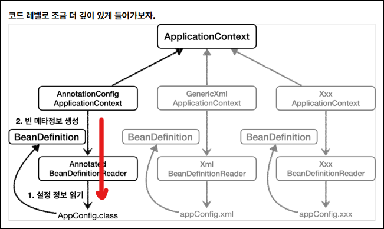

# 🟢 스프링 핵심 원리 - 기본편

## 📄 Section04 - 스프링 컨테이너와 스프링 빈
### ✅ 스프링 컨테이너와 스프링 빈
- ApplicationContext
    - 스프링 컨테이너
    - 인터페이스
        - 생성 방법1) XML 기반
        - 생성 방법2) 애노테이션 기반(@Configuration)의 자바 설정 클래스
    - 구분: (**_BeanFactory_** / **_ApplicationContext_**)
        - 직접 사용하는 경우 거의 없어서, 일반적으로 ApplicationContext 를 스프링 컨테이너라 부름


- 스프링 컨테이너 생성 방법2) 애노테이션 기반(@Configuration)의 자바 설정 클래스
  ```java
    ApplicationContext applicationContext 
       = new AnnotationConfigApplicationContext(AppConfig.class);
  ```
  ```java
    @Configuration
    public class AppConfig {
  
    }
  ```


- 스프링 컨테이너 생성 과정
  - 
  - 
  - 

<br/>

### ✅ 스프링 빈 조회
- 스프링 빈 조회
    ```java
    AnnotationConfigApplicationContext ac = 
        new AnnotationConfigApplicationContext(AppConfig.class)

    String[] beanDefinitionNames = ac.getBeanDefinitionNames();
    for (String beanDefinitionName : beanDefinitionNames){
        Object bean = ac.getBean(beanDefinitionName);
        MemberService bean = ac.getBean("memberService", MemberService.class)
        MemberService bean = ac.getBean(MemberService.class)
  
        BeanDefinition beanDefinition = ac.getBeanDefinition(beanDefinitionName);
    }
  
    Map<String, MemberRepository> beansOfType = ac.getBeansOfType(MemberRepository.class);
    for (String key : beansOfType.keySet()){
            System.out.println("key = " + key + "/ value = " + beansOfType.get(key));
    }
    ```

<br/>

### ✅ BeanFactory 와 ApplicationContext
- 
- BeanFactory
  - 스프링 컨테이너의 최상위 인터페이스
  - 스프링 빈 관리와 조회
  - `getBean()` 제공


- ApplicationContext
  - BeanFactory 상속
  - BeanFactory 역할(스프링 빈 관리와 조회) + 수 많은 부가기능
  - 
    - **_MessageSource(메시지소스를 이용한 국제화)_**: 한국에서 들어오면 한국어로 출력 지원
    - **_EnvironmentCapable(환경 변수)_**: 로컬, 개발(테스트), 운영 구분 처리 지원
    - **_ApplicationEventPublisher(애플리케이션 이벤트)_**: 이벤트를 발행하고 구독하는 모델 지원
    - **_ResourceLoader(편리한 리소스 조회)_**: 파일, 클래스 패스, 외부 등에서 리소스 편리하게 조회 지원

<br/>

### ✅ 스프링 컨테이너 생성 방법
- 
- 생성 방법1) 애노테이션 기반(@Configuration)의 자바 설정 클래스
- 생성 방법2) XML 기반

<br/>

### ✅ BeanDefinition
- **_스프링 빈 설정 메타정보_**
- 인터페이스
- **_스프링 컨테이너_** 의 다양한 설정 형식 지원
  - 스프링 컨테이너는 BeanDefinition 만 판단
  - 스프링 컨테이너는 BeanDefinition(빈 설정 메타정보)로 스프링 빈 생성
  - 스프링 컨테이너는 BeanDefinition(interface)추상화에 의존
- 역할과 구현을 개념적으로 나눔
  - XML 을 읽어서 BeanDefinition 만들기
  - 자바 코드를 읽어서 BeanDefinition 만들기


- 
  1. AnnotationConfigApplicationContext 의 **_reader 필드_** 를 통해<br> 
    **_AppConfig.class 의 정보 읽기_**
  2. AnnotationConfigApplicationContext 가 해당 정보 토대로<br>
    **_BeanDefinition(빈 설정 메타정보)생성_**


- BeanClassName: 생성할 빈의 클래스 명(자바 설정 처럼 팩토리 역할의 빈을 사용하면 없음)
- factoryBeanName: 팩토리 역할의 빈을 사용할 경우 이름, 예) appConfig 
- factoryMethodName: 빈을 생성할 팩토리 메서드 지정, 예) memberService 
- Scope: 싱글톤(기본값)
- lazyInit: 스프링 컨테이너를 생성할 때 빈을 생성하는 것이 아니라, 실제 빈을 사용할 때 까지 최대한
  생성을 지연처리 하는지 여부 
- InitMethodName: 빈을 생성하고, 의존관계를 적용한 뒤에 호출되는 초기화 메서드 명 
- DestroyMethodName: 빈의 생명주기가 끝나서 제거하기 직전에 호출되는 메서드 명 
- Constructor arguments, Properties: 의존관계 주입에서 사용한다. (자바 설정 처럼 팩토리 역할의
  빈을 사용하면 없음)