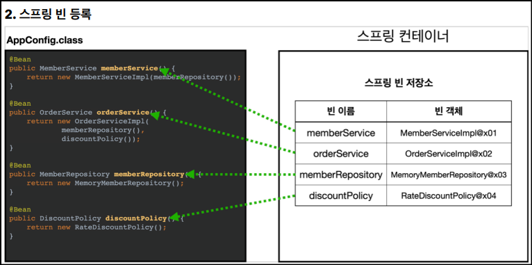

# 🟢 스프링 핵심 원리 - 기본편

## 📄 Section04 - 스프링 컨테이너와 스프링 빈
### ✅ 스프링 컨테이너와 스프링 빈
- ApplicationContext
    - 스프링 컨테이너
    - 인터페이스
        - 생성 방법1) XML 기반
        - 생성 방법2) 애노테이션 기반(@Configuration)의 자바 설정 클래스
    - 구분: (**_BeanFactory_** / **_ApplicationContext_**)
        - 직접 사용하는 경우 거의 없어서, 일반적으로 ApplicationContext 를 스프링 컨테이너라 부름


- 스프링 컨테이너 생성 방법2) 애노테이션 기반(@Configuration)의 자바 설정 클래스
  ```
    ApplicationContext applicationContext 
       = new AnnotationConfigApplicationContext(AppConfig.class);
  ```
  ```
    @Configuration
    public class AppConfig {
  
    }
  ```


- 스프링 컨테이너 생성 과정
  1. 스프링 컨테이너 생성
     - 
  2. 스프링 빈 등록
     - 
  3. 스프링 빈 의존관계 설정 - 준비 및 완료
     - 