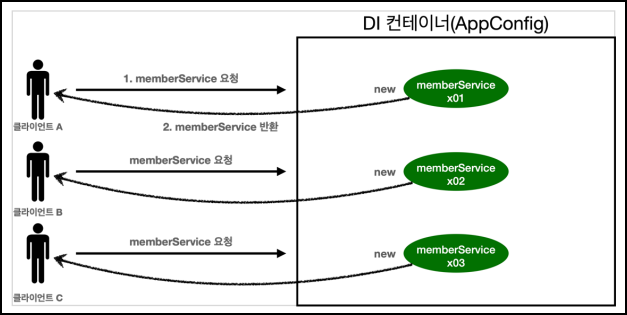

# 🟢 스프링 핵심 원리 - 기본편

## 📄 Section05 싱글톤 컨테이너
### ✅ 웹 애플리케이션과 싱글톤
- 스프링 애플리케이션
  - 대부분 웹 애플리케이션
  - 대부분 여러 고객이 동시에 요청
  - 
    - 순수한 DI 컨테이너 AppConfig는 요청 시 객체 계속 생성
    - 메모리 낭비
    - 해결: ***싱글톤 패턴*** 으로 해결  
      -> 해당 객체가 1개만 생성되고, 공유 되도록 설계


### ✅ 싱글톤 패턴
- 싱글톤 패턴
  - 클래스의 인스턴스가 1개만 생성
  - 
    ```java
    public class SingletonService {
    
      //1. static 영역에 객체를 딱 1개만 생성
      private static final SingletonService instance = new SingletonService();
  
      //2. public으로 열어서 객체 인스턴스가 필요하면 이 static 메서드를 통해서만 조회
      public static SingletonService getInstance() {
       return instance;
      }
    
      //3. 생성자를 private으로 선언해서 외부에서 new 키워드를 사용한 객체 생성을 못하게 막는다.
      private SingletonService() {
      }
  
      public void logic() {
        System.out.println("싱글톤 객체 로직 호출");
      }
    }
    ```

- 싱글톤 패턴 문제점
  - 싱글톤 패턴 구현 코드 많음
  - 클라이언트가 구체클래스에 의존
    - OCP, DIP 위반
  - 테스트 어렵
    - 싱글톤은 getter로 가져오기 때문에 유연하게 테스트 어렵
  - 내부 속성 변경, 초기화 어렵
  - 자식클래스 만들기 어렵
    - private 생성자를 이용