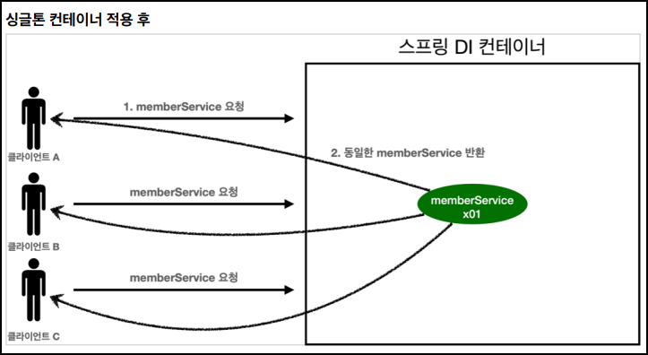
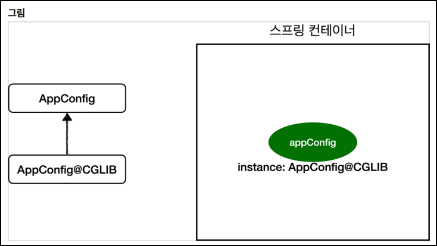

# 🟢 스프링 핵심 원리 - 기본편

## 📄 Section05 싱글톤 컨테이너
### ✅ 웹 애플리케이션과 싱글톤
- 스프링 애플리케이션
  - 대부분 웹 애플리케이션
  - 대부분 여러 고객이 동시에 요청
  - 
    - 순수한 DI 컨테이너 AppConfig는 요청 시 객체 계속 생성
    - 메모리 낭비
    - 해결: ***싱글톤 패턴*** 으로 해결  
      -> 해당 객체가 1개만 생성되고, 공유 되도록 설계


### ✅ 싱글톤 패턴
- 싱글톤 패턴
  - 클래스의 인스턴스가 1개만 생성
  - 
    ```java
    public class SingletonService {
    
      //1. static 영역에 객체를 딱 1개만 생성
      private static final SingletonService instance = new SingletonService();
  
      //2. public으로 열어서 객체 인스턴스가 필요하면 이 static 메서드를 통해서만 조회
      public static SingletonService getInstance() {
       return instance;
      }
    
      //3. 생성자를 private으로 선언해서 외부에서 new 키워드를 사용한 객체 생성을 못하게 막는다.
      private SingletonService() {
      }
  
      public void logic() {
        System.out.println("싱글톤 객체 로직 호출");
      }
    }
    ```

- 싱글톤 패턴 문제점
  - 싱글톤 패턴 구현 코드 많음
  - 클라이언트가 구체클래스에 의존
    - OCP, DIP 위반
  - 테스트 어렵
    - 싱글톤은 getter로 가져오기 때문에 유연하게 테스트 어렵
  - 내부 속성 변경, 초기화 어렵
  - 자식클래스 만들기 어렵
    - private 생성자를 이용


### ✅ 싱글톤 컨테이너
- 스프링 컨테이너: 싱글톤 컨테이너 역할
  - 객체 인스턴스를 싱글톤으로 생성
    - **_스프링 빈_**: 싱글톤으로 관리
  - **_싱글톤 패턴을 적용하지 않아도_**, 객체 인스턴스를 싱글톤으로 생성 및 관리
    - **_싱글톤 레지스트리_**: 싱글톤 객체를 생성하고 관리하는 기능
  - 싱글톤 패턴 문제점 해결
    - 코드 간결 
    - OCP, DIP, 테스트, private 생성자 이용X
  - 
    - 스프링의 기본 빈 등록 방식은 싱글톤
      - +) 요청할 때마다 새로운 객체 생성해서 반환하는 기능도 제공 (빈 스코프)


### ✅ 싱글톤 방식의 주의점
- **_싱글톤 패턴_** 이든 **_스프링 같은 싱글톤 컨테이너_** 이든 상태 유지(Stateful)하게 설계X
  - 해결: 무상태로 설계
    - 특정 클라이언트에 의존 필드X
    - 특정 클라이언트 값 변경 필드X
    - 되도록 읽기만
    - 지역변수, 파라미터, ThreadLocal (필드 대신에 자바에서 공유되지 않는 것)


### ✅ @Configuration 과 스프링 컨테이너의 바이트 코드 조작
- ```java
    public class MemberServiceImpl implements MemberService {
       private final MemberRepository memberRepository;
       
       //테스트 용도
       public MemberRepository getMemberRepository() {
          return memberRepository;
       }
    }

     public class OrderServiceImpl implements OrderService {
        private final MemberRepository memberRepository;
    
        //테스트 용도
        public MemberRepository getMemberRepository() {
          return memberRepository;
        }
     }
  ```
  ```java
  public class ConfigurationSingletonTest {
  
        @Test
        void configurationTest() {
           ApplicationContext ac = new AnnotationConfigApplicationContext(AppConfig.class);
            
           MemberServiceImpl memberService = ac.getBean("memberService", MemberServiceImpl.class);
           OrderServiceImpl orderService = ac.getBean("orderService", OrderServiceImpl.class);
           MemberRepository memberRepository = ac.getBean("memberRepository", MemberRepository.class);
            
           Assertions.assertThat(memberService.getMemberRepository()).isSameAs(memberRepository);
           Assertions.assertThat(orderService.getMemberRepository()).isSameAs(memberRepository);
        }
  
        @Test
        void configurationDeep(){
            ApplicationContext ac = new AnnotationConfigApplicationContext(AppConfig.class);
            AppConfig bean = ac.getBean(AppConfig.class);
  
            System.out.println("bean = " + bean.getClass());
        }     
     }
  ```


- @Configuration 적용O, @Bean 적용O _**(스프링 컨테이너의 바이트 코드 조작)**_
  - **_MemberRepository 1개 생성_**
  - **_출력_** 
    ```text
    스프링 컨테이너의 바이트 코드 조작 후 클래스
    class hello.core.AppConfig$$EnhancerBySpringCGLIB$$bd479d70
    ```
  - 
  - **_로직(AppConfig@CGLIB 예상 코드)_**
    ```
    @Bean
    public MemberRepository memberRepository() {
        if (memoryMemberRepository가 이미 스프링 컨테이너에 등록되어 있으면?) {
            return 스프링 컨테이너에서 찾아서 반환;
        } else { 
            //스프링 컨테이너에 없으면 기존 로직을 호출해서 
            //MemoryMemberRepository를 생성하고 스프링 컨테이너에 등록
            return 반환
        }
    }
    ```
    

- @Configuration 적용X , @Bean 적용O
  - **_MemberRepository 여러 개 생성_** 
  - **_출력_**
    ```text
    순수 클래스
    class hello.core.AppConfig
    ```