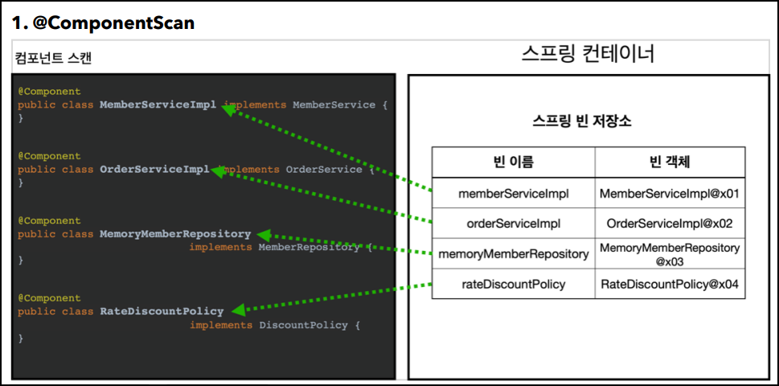
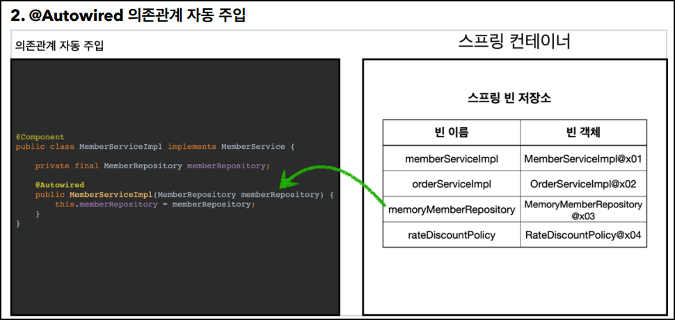
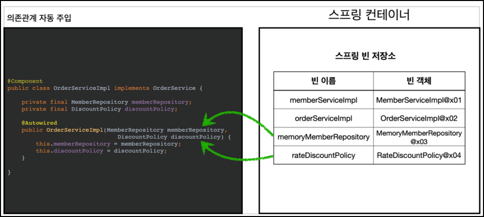

# 🟢 스프링 핵심 원리 - 기본편

## 📄 Section06 컴포넌트 스캔
### ✅ 컴포넌트 스캔(`@ComponentScan`)
- 컴포넌트 스캔(`@ComponentScan`)
  - 설정 정보( `@Bean`/`<bean/>`)가 없어도 **_자동으로 스프링 빈을 등록_**
  - `@Component` 붙은 클래스를 **_자동으로 스프링 빈을 등록_**
    - `excludeFilters` 설정  
      -> `@Configuration` 붙은 클래스 제거(`@Configuration`에 `@Component`가 등록되있음)  
      -> 즉 AppConfig 의 스프링 빈, 테스트 코드의 `@Configuration`붙은 클래스 제외
  - `@Bean` 으로 등록된 클래스가 없음

 

### ✅ 자동 의존관계 주입(`@Autowired`)
- 자동 의존관계 주입(`@Autowired`)
    - 의존관계 명시 없어도 **_자동으로 스프링 빈 의존관계 주입_**

- 
  - 스프링 빈의 이름: 맨 앞글자만 소문자
  - 스프링 빈의 이름 설정: `@Component("memberServiceImpl)`  
- 
- 
  - 자동 의존 관계 주입 전략: `Type`이 같은 스프링 빈을 찾음(만약 `Type`이 같은 스프링 빈 여러개면 충돌)

 

### ✅ 컴포넌트 스캔(`@ComponentScan`)의 설정
- 컴포넌트 스캔(`@ComponentScan`)의 설정 - **_탐색 위치 설정_**
  - 설정 종류
    - `basePackages` 
      -> **_해당 패키지_** 부터 하위 패키지 까지 탐색 
      -> `basePackages = {"hello.core", "hello.service"}`
    - `basePackageClasses` 
      -> **_지정한 클래스의 패키지_** 부터 하위 패키지 까지 탐색
    - **_default_** 
      -> **_설정 정보 클래스의 위치의 패키지_** 부터 하위 패키지 까지 탐색 
      -> 따라서 설정 정보 클래스의 위치를 프로젝트 최상단에 두기 
      -> 따라서 `@SpringBootApplication`(스프링 부트 대표 시작정보)를 프로젝트 최상단에 두기
         - `@SpringBootApplication` 안에 `@ComponentScan` 등록됨  
  - 컴포넌트 스캔 기본 대상(`@Component` 등록됨)
    - `@Component`: 컴포넌트 스캔에서 사용
    - `@Controller`: 스프링 MVC 컨트롤러에서 사용
    - `@Service`: 스프링 비즈니스 로직에서 사용
    - `@Repository`: 스프링 데이터 접근 계층에서 사용
    - `@Configuration`: 스프링 설정 정보에서 사용