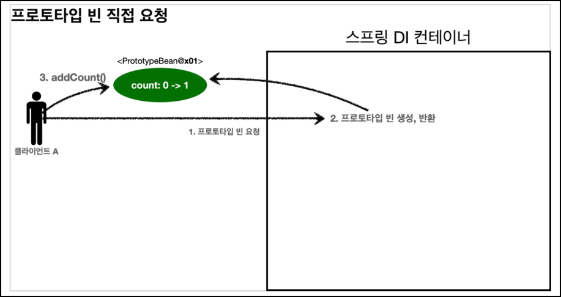
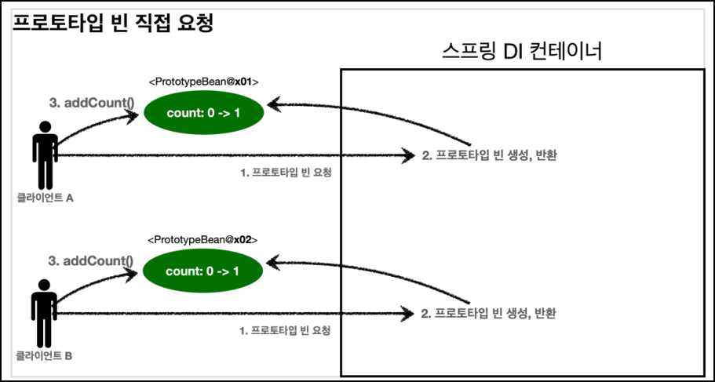
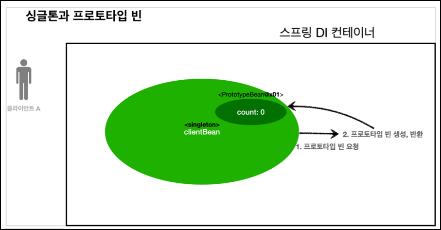
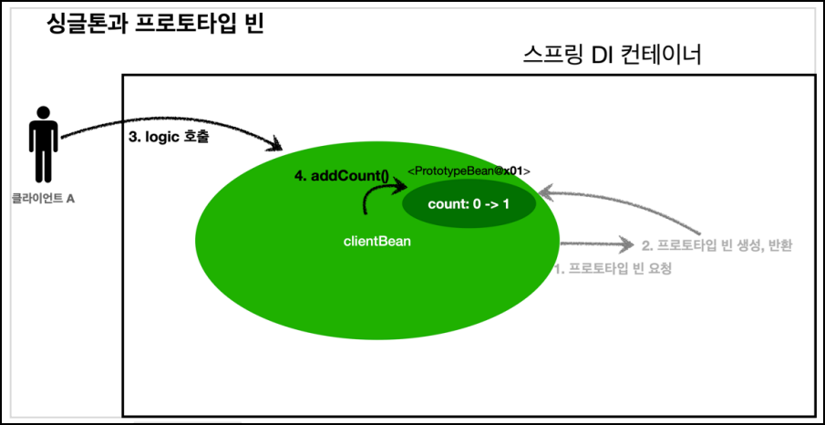
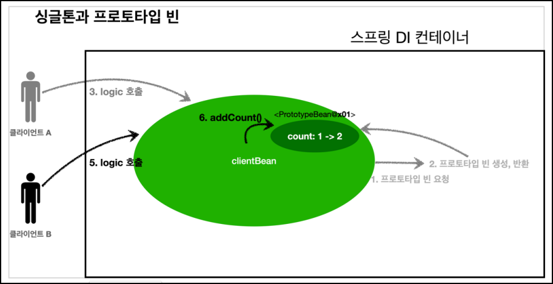

# 🟢 스프링 핵심 원리 - 기본편

## 📄 Section09 스프링 빈 스코프
### ✅ 스프링 빈 스코프
- 스프링 빈
  - 스프링 컨테이너 시작과 함께 생성
  - 스프링 컨테이너가 종료될 때까지 유지
  - **_싱글톤 스코프_** 로 생성


- 스프링 빈 스코프
  - 스프릥 빈이 존재할 수 있는 범위(기간)


- 스프링 빈 스코프 지원
  - **_싱글톤_**
    - 기본 스코프
    - 스프링 컨테이너 시작과 종료까지 유지
  - **_프로토타입_**
    - 스프링 컨테이너는 프로토타입 빈의 생성과 의존관계 주입까지만 관여
    - 스프링 컨테이너가 이후는 관리하지 않음
  - **_웹 관련 스코프_**
    - **_request_**: 웹 요청이 들어오고 나갈때까지 유지
    - **_session_**: 웹 세션이 생성되고 종료될때까지 유지
    - **_application_**: 웹의 서블릿 컨텍스와 같은 범위로 유지


- 스프링 빈 스코프 생성
  - 컴포넌트 스캔 자동 등록
    ```java
      @Scope("prototype")
      @Component
      public class HelloBean {}
    ```

  - 컴포넌트 스캔 수동 등록
    ```java
      @Scope("prototype")
      @Bean
      PrototypeBean HelloBean() {
        return new HelloBean();
      }
    ```

<br/>

### ✅ 스프링 빈 스코프 - 싱글톤 스코프, 프로토타입 스코프
- **_싱글톤 스코프_**: 같은 인스턴스의 스프링 빈
  - 
    - 싱글톤 스코프의 빈을 스프링 컨테이너에 요청
    - 스프링 컨테이너 해당 스프링 빈 반환, 필요 의존관계를 주입
      - 같은 요청이 와도 같은 객체 인스턴스의 스프링 빈 반환
      

- **_프로토타입 스코프_**: 새로운 인스턴스의 스프링 빈
  - 
  - 
    - 프로토타입 스코프의 빈을 스프링 컨테이너에 요청
    - 스프링 컨테이너 해당 스프링 반환, 필요 의존관계를 주입
      - 같은 요청이 올때 마다 새로운 객체 인스턴스의 스프링 반환
  - 스프링 컨테이너 프로토타입 빈을 생성, 의존관계 주입, 초기화까지만 처리
  - 스프링 컨테이너가 이후는 관리하지 않음
    - 프로토타입 빈을 관리할 책임은 **_클라이언트_**
    - `@PreDestroy` 같은 종료 메소드 호출X

<br/>

### ✅ 스프링 빈 스코프 - 싱글톤 스코프, 프로토타입 스코프 함께 사용 시 문제점
- **_클라이언트 -> 프로토타입 빈_** 직접 요청
  - 
  - 
    - 클라이언트 A가 프로토타입 빈을 스프링 컨테이너에 요청
    - 스프링 컨테이너 새로운 스프링 빈 반환
    - 클라이언트 A가 프로토타입 빈 `addCount()` 호출 및 `count 필드 + 1 -> 1` 세팅
      <br><br>
    - 클라이언트 B가 프로토타입 빈을 스프링 컨테이너에 요청
    - 스프링 컨테이너 새로운 스프링 빈 반환
    - 클라이언트 B가 프로토타입 빈 `addCount()` 호출 및 `count 필드 + 1 -> 1` 세팅


- **_클라이언트 -> 싱글톤 빈 -> 프로토타입 빈_** 요청
  - 
  - 
  - 
    - `clientBean`은 싱글톤이므로 **_의존관계 자동 주입_** 을 통해, 프로토타입 빈 요청
      - 주입 시점에 스프링 컨테이너에 프로토타입 빈 요청
      - 스프링 컨테이너는 프로토타입 빈 생성해 `clientBean`에 반환
      - `clientBean`은 프로토타입 빈 내부 필드에 보관
      <br><br>
    - 클라이언트 A가 싱글톤 빈(`clientBean`)을 스프링 컨테이너에 요청
    - 스프링 컨테이너 해당 스프링 빈 반환
    - 클라이언트 A가 싱글톤 빈(`clientBean`)의 `addCount()` 호출 및 `count 필드 + 1 -> 1` 세팅
      <br><br>
    - 클라이언트 B가 싱글톤 빈(`clientBean`)을 스프링 컨테이너에 요청
    - 스프링 컨테이너 해당 스프링 빈 반환
    - 클라이언트 A가 싱글톤 빈(`clientBean`)의 `addCount()` 호출 및 `count 필드 + 1 -> 2` 세팅

  - `clientBean`이 내부에 가지고 있는 프로토타입 빈은 이미 과거에 주입이 끝난 빈<br>
    사용 할 때마다 새로 생성되는 것이 **_아님_**
  - ```java
    @Scope("singleton")
    static class ClientBean {
        private final PrototypeBean prototypeBean;

        @Autowired
        public ClientBean(PrototypeBean prototypeBean){
            this.prototypeBean = prototypeBean;
        }

        public int logic() {
            this.prototypeBean.addCount();
            return prototypeBean.getCount();
        }
    }
    ```


- 해결) **_클라이언트 -> 싱글톤 빈 -> 프로토타입 빈_** 요청
  - **_프로토타입 빈_** 을 **_주입 시점에만 새로 생성하는 것_** 이 아니라, <br>
    **_사용할 때 마다 생성하는 것_** 이 사용 이유
  - ```java
    @Scope("singleton")
    static class ClientBean {

        @Autowired
        ApplicationContext applicationContext;

        public int logic() {
            PrototypeBean prototypeBean = applicationContext.getBean(PrototypeBean.class);
            prototypeBean.addCount();
            return prototypeBean.getCount();
        }
    }
    ```
    - **_의존관계 주입(DI = Dependency Injection)_** -> **X**
    - **_의존관계 조회(DL = Dependency Lookup)_** -> **O**
    - 스프링 컨테이너에 종속적
    - 단위 테스트 어렵
    

- **_여러 빈에서 같은 프로토타입 빈_** 을 주입 받으면, **_주입 받는 시점_** 에 **_각각 새로운 프로토타입 빈_** 이 생성
  - **_clientA, clientB_** 가 각각 의존관계 주입을 받으면, **_각각 다른 인스턴스의 프로토타입
    빈_** 을 주입
    - clientA prototypeBean@x01
    - clientB prototypeBean@x02