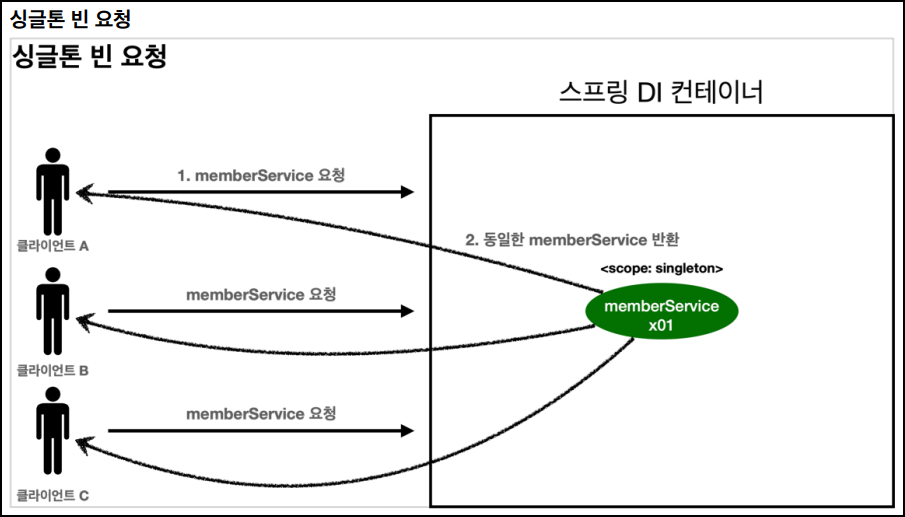
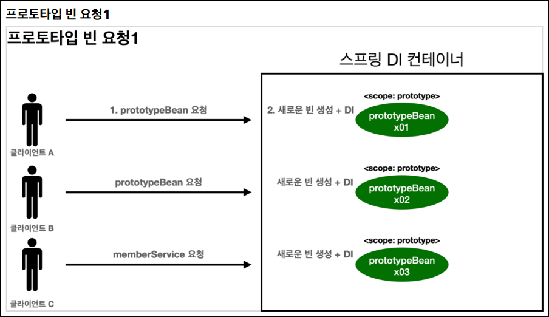
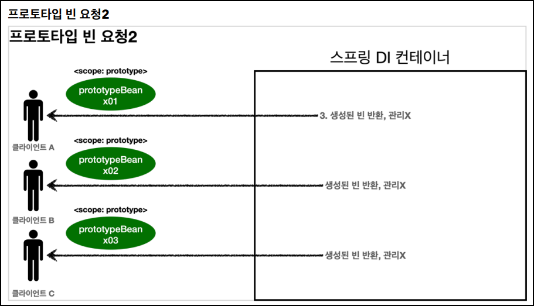

# 🟢 스프링 핵심 원리 - 기본편

## 📄 Section09 스프링 빈 스코프
### ✅ 스프링 빈 스코프
- 스프링 빈
  - 스프링 컨테이너 시작과 함께 생성
  - 스프링 컨테이너가 종료될 때까지 유지
  - **_싱글톤 스코프_** 로 생성


- 스프링 빈 스코프
  - 스프릥 빈이 존재할 수 있는 범위(기간)


- 스프링 빈 스코프 지원
  - **_싱글톤_**
    - 기본 스코프
    - 스프링 컨테이너 시작과 종료까지 유지
  - **_프로토타입_**
    - 스프링 컨테이너는 프로토타입 빈의 생성과 의존관계 주입까지만 관여
    - 스프링 컨테이너가 이후는 관리하지 않음
  - **_웹 관련 스코프_**
    - **_request_**: 웹 요청이 들어오고 나갈때까지 유지
    - **_session_**: 웹 세션이 생성되고 종료될때까지 유지
    - **_application_**: 웹의 서블릿 컨텍스와 같은 범위로 유지


- 스프링 빈 스코프 생성
  - 컴포넌트 스캔 자동 등록
    ```java
      @Scope("prototype")
      @Component
      public class HelloBean {}
    ```

  - 컴포넌트 스캔 수동 등록
    ```java
      @Scope("prototype")
      @Bean
      PrototypeBean HelloBean() {
        return new HelloBean();
      }
    ```

<br/>

### ✅ 스프링 빈 스코프 - 싱글톤 스코프, 프로토타입 스코프
- **_싱글톤 스코프_**: 같은 인스턴스의 스프링 빈
  - 
    - 싱글톤 스코프의 빈을 스프링 컨테이너에 요청
    - 스프링 컨테이너 해당 스프링 빈 반환, 필요 의존관계를 주입
      - 같은 요청이 와도 같은 객체 인스턴스의 스프링 빈 반환
      

- **_프로토타입 스코프_**: 새로운 인스턴스의 스프링 빈
  - 
  - 
    - 프로토타입 스코프의 빈을 스프링 컨테이너에 요청
    - 스프링 컨테이너 해당 스프링 반환, 필요 의존관계를 주입
      - 같은 요청이 올때 마다 새로운 객체 인스턴스의 스프링 반환
  - 스프링 컨테이너 프로토타입 빈을 생성, 의존관계 주입, 초기화까지만 처리
  - 스프링 컨테이너가 이후는 관리하지 않음
    - 프로토타입 빈을 관리할 책임은 **_클라이언트_**
    - `@PreDestroy` 같은 종료 메소드 호출X