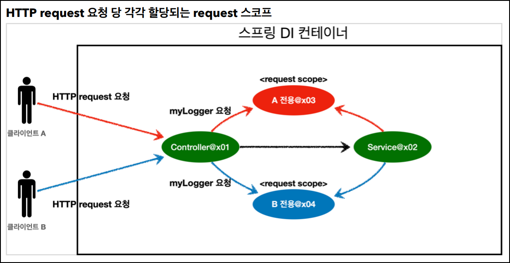

# 🟢 스프링 핵심 원리 - 기본편

## 📄 Section09 스프링 빈 스코프
### ✅ 스프링 빈 스코프
- 스프링 빈
  - 스프링 컨테이너 시작과 함께 생성
  - 스프링 컨테이너가 종료될 때까지 유지
  - **_싱글톤 스코프_** 로 생성


- 스프링 빈 스코프
  - 스프릥 빈이 존재할 수 있는 범위(기간)


- 스프링 빈 스코프 지원
  - **_싱글톤_**
    - 기본 스코프
    - 스프링 컨테이너 시작과 종료까지 유지
  - **_프로토타입_**
    - 스프링 컨테이너는 프로토타입 빈의 생성과 의존관계 주입까지만 관여
    - 스프링 컨테이너가 이후는 관리하지 않음
  - **_웹 관련 스코프_**
    - **_request_**: 웹 요청이 들어오고 나갈때까지 유지
    - **_session_**: 웹 세션이 생성되고 종료될때까지 유지
    - **_application_**: 웹의 서블릿 컨텍스트와 같은 범위로 유지


- 스프링 빈 스코프 생성
  - 컴포넌트 스캔 자동 등록
    ```java
      @Scope("prototype")
      @Component
      public class HelloBean {}
    ```

  - 컴포넌트 스캔 수동 등록
    ```java
      @Scope("prototype")
      @Bean
      PrototypeBean HelloBean() {
        return new HelloBean();
      }
    ```

<br/>

### ✅ 스프링 빈 스코프 - 싱글톤 스코프, 프로토타입 스코프
- **_싱글톤 스코프_**: 같은 인스턴스의 스프링 빈
  - 
    - 싱글톤 스코프의 빈을 스프링 컨테이너에 요청
    - 스프링 컨테이너 해당 스프링 빈 반환, 필요 의존관계를 주입
      - 같은 요청이 와도 같은 객체 인스턴스의 스프링 빈 반환
      

- **_프로토타입 스코프_**: 새로운 인스턴스의 스프링 빈
  - 
  - 
    - 프로토타입 스코프의 빈을 스프링 컨테이너에 요청
    - 스프링 컨테이너 해당 스프링 반환, 필요 의존관계를 주입
      - 같은 요청이 올때 마다 새로운 객체 인스턴스의 스프링 반환
  - 스프링 컨테이너 프로토타입 빈을 생성, 의존관계 주입, 초기화까지만 처리
  - 스프링 컨테이너가 이후는 관리하지 않음
    - 프로토타입 빈을 관리할 책임은 **_클라이언트_**
    - `@PreDestroy` 같은 종료 메소드 호출X

<br/>

### ✅ 스프링 빈 스코프 - 싱글톤 스코프, 프로토타입 스코프 함께 사용 시 문제점
- **_클라이언트 -> 프로토타입 빈_** 직접 요청
  - 
  - 
    - 클라이언트 A가 프로토타입 빈을 스프링 컨테이너에 요청
    - 스프링 컨테이너 새로운 스프링 빈 반환
    - 클라이언트 A가 프로토타입 빈 `addCount()` 호출 및 `count 필드 + 1 -> 1` 세팅
      <br><br>
    - 클라이언트 B가 프로토타입 빈을 스프링 컨테이너에 요청
    - 스프링 컨테이너 새로운 스프링 빈 반환
    - 클라이언트 B가 프로토타입 빈 `addCount()` 호출 및 `count 필드 + 1 -> 1` 세팅


- **_클라이언트 -> 싱글톤 빈 -> 프로토타입 빈_** 요청
  - 
  - 
  - 
    - `clientBean`은 싱글톤이므로 **_의존관계 자동 주입_** 을 통해, 프로토타입 빈 요청
      - 주입 시점에 스프링 컨테이너에 프로토타입 빈 요청
      - 스프링 컨테이너는 프로토타입 빈 생성해 `clientBean`에 반환
      - `clientBean`은 프로토타입 빈 내부 필드에 보관
      <br><br>
    - 클라이언트 A가 싱글톤 빈(`clientBean`)을 스프링 컨테이너에 요청
    - 스프링 컨테이너 해당 스프링 빈 반환
    - 클라이언트 A가 싱글톤 빈(`clientBean`)의 `addCount()` 호출 및 `count 필드 + 1 -> 1` 세팅
      <br><br>
    - 클라이언트 B가 싱글톤 빈(`clientBean`)을 스프링 컨테이너에 요청
    - 스프링 컨테이너 해당 스프링 빈 반환
    - 클라이언트 A가 싱글톤 빈(`clientBean`)의 `addCount()` 호출 및 `count 필드 + 1 -> 2` 세팅

  - `clientBean`이 내부에 가지고 있는 프로토타입 빈은 이미 과거에 주입이 끝난 빈<br>
    사용 할 때마다 새로 생성되는 것이 **_아님_**
  - ```java
    @Scope("singleton")
    static class ClientBean {
        private final PrototypeBean prototypeBean;

        @Autowired
        public ClientBean(PrototypeBean prototypeBean){
            this.prototypeBean = prototypeBean;
        }

        public int logic() {
            this.prototypeBean.addCount();
            return prototypeBean.getCount();
        }
    }
    ```


- 해결) **_클라이언트 -> 싱글톤 빈 -> 프로토타입 빈_** 요청
  - **_프로토타입 빈_** 을 **_주입 시점에만 새로 생성하는 것_** 이 아니라, <br>
    **_사용할 때 마다 생성하는 것_** 이 사용 이유
  - ```java
    @Scope("singleton")
    static class ClientBean {

        @Autowired
        ApplicationContext applicationContext;

        public int logic() {
            PrototypeBean prototypeBean = applicationContext.getBean(PrototypeBean.class);
            prototypeBean.addCount();
            return prototypeBean.getCount();
        }
    }
    ```
    - **_의존관계 주입(DI = Dependency Injection)_** -> **X**
    - **_의존관계 조회(DL = Dependency Lookup)_** -> **O**
    - 스프링 컨테이너에 종속적
    - 단위 테스트 어렵
    

- **_여러 빈에서 같은 프로토타입 빈_** 을 주입 받으면, **_주입 받는 시점_** 에 **_각각 새로운 프로토타입 빈_** 이 생성
  - **_clientA, clientB_** 가 각각 의존관계 주입을 받으면, **_각각 다른 인스턴스의 프로토타입
    빈_** 을 주입
    - clientA prototypeBean@x01
    - clientB prototypeBean@x02

<br>

### ✅ 스프링 빈 스코프 - 싱글톤 스코프, 프로토타입 스코프 함께 사용 시 문제점 해결
- **_해결)_** 의존관계 조회(DL = Dependency Lookup)
  - 스프링 컨테이너에 종속적
  - 단위 테스트 어렵


- **_해결)_** `ObjectFactory`, `ObjectProvider`
  - 의존관계 조회(DL = Dependency Lookup) 
    - 지정한 빈을 컨테이너에서 대신 찾아줌
  - `ObjectFactory`
    - 기능이 단순
    - 별도의 라이브러리 필요 없음
    - 스프링에 의존
  - `ObjectProvider`
    - `ObjectFactory` 상속
    - 옵션, 스트림 처리 편의기능 많음
    - 별도의 라이브러리 필요 X
    - 스프링에 의존

  - ```java
    @Scope("singleton")
    static class ClientBean {

        private final ObjectProvider<PrototypeBean> prototypeBeanObjectProvider;

        @Autowired
        public ClientBean(ObjectProvider<PrototypeBean> prototypeBeanObjectProvider){
            this.prototypeBeanObjectProvider = prototypeBeanObjectProvider;
        }

        public int logic() {
            PrototypeBean prototypeBean = this.prototypeBeanObjectProvider.getObject();
            prototypeBean.addCount();
            return prototypeBean.getCount();
        }
    }
    ```


- **_해결)_** `JSR-330 Provider`
  - 의존관계 조회(DL = Dependency Lookup)
    - 지정한 빈을 컨테이너에서 대신 찾아줌
  - `JSR-330 Provider`
    - **(스프링 부트 3.0 미만)**
      - `javax.inject.Provider`인 `JSR-330` 자바 표준을 사용
      - `javax.inject:javax.inject:1` 라이브러리를 `gradle` 에 추가
    - **(스프링 부트 3.0 이상)**
      - `jakarta.inject.Provider` 사용
      - `jakarta.inject:jakarta.inject-api:2.0.1` 라이브러리를 `gradle` 에 추가
    - 별도의 라이브러리 필요
    - 스프링에 의존 X


  - ```java
    @Scope("singleton")
    static class ClientBean {

        private final Provider<PrototypeBean> prototypeBeanObjectProvider;

        @Autowired
        public ClientBean(Provider<PrototypeBean> prototypeBeanObjectProvider){
            this.prototypeBeanObjectProvider = prototypeBeanObjectProvider;
        }

        public int logic() {
            PrototypeBean prototypeBean = this.prototypeBeanObjectProvider.get();
            prototypeBean.addCount();
            return prototypeBean.getCount();
        }
    }
    ```  
    

- 정리
  - **_프로토타입 빈 사용 시점_**
    - 사용할 때 마다 의존관계 주입이 완료된 새로운 객체 필요 시, 사용
    - 대부분 `싱글톤 빈`으로 해결되기 때문에, 거의 사용 X

<br>

### ✅ 스프링 빈 스코프 - 웹 스코프
- 웹 스코프
  - 웹 환경에서만 동작
  - 해당 스코프의 종료시점 까지 관리, 종료 메소드 호출


- 웹 스코프 종류
  - **_request_**
    - 웹 요청이 들어오고 나갈때까지 유지
    - HTTP 요청마다 새로운 인스턴스 생성 및 관리
  - **_session_**
    - 웹 세션이 생성되고 종료될때까지 유지
  - **_application_**
    - 웹의 서블릿 컨텍스트와 같은 범위로 유지


- 웹 스코프 - request 스코프
  - 


- 웹 스코프 - request 스코프 예제
  - `implementation 'org.springframework.boot:spring-boot-starter-web'` 추가
    - 내장 톰켓 서버를 활용해서 웹 서버와 스프링을 함께 실행
    - 웹 라이브러리 X
      - `AnnotationConfigApplicationContext` 를 기반으로 애플리케이션 구동
    - 웹 라이브러리 O
      - `AnnotationConfigServletWebServerApplicationContext` 를 기반으로 애플리케이션 구동

  - **_예제_**
    - 여러 HTTP 요청이 와서 로그 구분 어려울때, 사용
      - **_기대하는 공통 포맷_**: `[UUID][requestURL]{message}`
        - `UUID` 를 사용해 HTTP 요청 구분
        - `requestURL` 을 사용해 어떤 URL 요청한 로그인지 확인
      <br/><br/>
      - `MyLogger` 클래스 
        - **_request 스코프_** 이기 때문에, **_HTTP 요청이 들어오고 나갈때 까지 유지_** -> **오류❗**
            - **해결)** `Provider` 이용<br/>
              -> **_DI(Dependency Injection)_**: `Provider`<br/>
              -> **_DL(Dependency Lookup)_**: `MyLogger`<br/>
              -> `MyLogger`: **_request 스코프_** 이기 때문에, **_스프링 만들어지는 시점 존재X_**<br/>
              -> `MyLogger`: **_request 스코프_** 이기 때문에, **_사용할 때 마다 생성하는 것_**
      <br/><br/>
      - `LogDemoController` 클래스
        - 로거 출력하는 테스트용 컨트롤러
        - `HttpServletRequest`를 통해서 요청 URL 받음
           - `http://localhost:8080/log-demo`
      <br/><br/>
      - `LogDemoService` 클래스
        - 로거 출력하는 테스트용 서비스
        - `MyLogger`(**_request 스코프_**) 사용 X
          - 서비스 계층에 전달되는 파라미터가 많아짐
          - `requestURL` 같은 웹 관련 정보 전달됨 
        - `MyLogger`(**_request 스코프_**) 사용 O
          - 서비스 계층에 전달되는 파라미터 없음
          - `myLogger` 멤버변수에 저장해 코드와 계층을 구분


- 웹 스코프 - request 스코프 예제 문제 해결
  - **_해결)_** `ObjectProvider` 이용
    - `ObjectProvider.getObject()`
      - 호출 시점까지 **_request 스코프 빈_** 생성을 지연
      - 호출 시점에는 **_HTTP 요청 진행_** 중이므로, **_request 스코프 빈_** 생성
      - `LogDemoController`, `LogDemoService` 에서 각각 한번씩 호출해도<br/>
        **_같은 HTTP 요청_** 이면 **_같은 스프링 빈_**